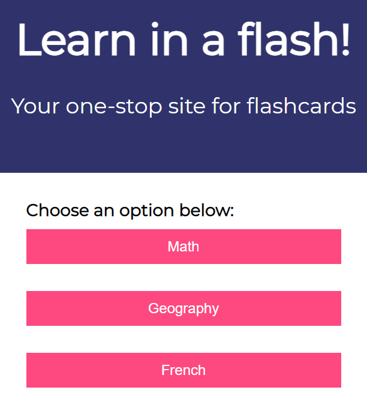

# Learn in a Flash  

## Description    
A JavaScript flashcard application to help people learn all sorts of facts.

## Table of Contents

* [Technologies Used](#technologies-used)

* [How to Use](#how-to-use)     

* [How and Why I Made This](#how-and-why-i-made-this)  

* [Deployed Application](#link-to-deployed-application)

* [GitHub Repo](#link-to-github-repo)

* [Future Development Ideas](#future-development-ideas)  

## Technologies Used    
Built in Visual Studio with          
HTML       
CSS    
Javascript           

## How to Use      
Navigate to https://alyssahellrung.github.io/flashcards. Here, you can choose which flashcard deck you would like to see by clicking a button. 
  
Once you click a button, you will immediately be taken to another page and presented with the first flash card in that subject. For example, if you choose "Math", you will see a math problem.  
  
When you click anywhere on the card, it will flip over to reveal the answer.     
     
You can click on the card as many times as you want to see the question and answer, but when you are ready to move to the next question, click the "Next Card" button and you will see the next problem.  
       
Every time you load the app, the cards will shuffle, so you will get the cards in a different order each time!  

      

## How and Why I Made This      
My daughter is learning her times tables, so I made her some physical flashcards on paper to help with memorization. As I was writing them all out, I thought, "Why not just make an app for this?" I found an excellent card-flipping animation tutorial by Tyler Potts (https://tinyurl.com/8g4krws9) for the action of the cards. I chose to bring in the data and shuffle it (using the Durstenfeld shuffle) so that the user is presented with the problems in a different order every time.  

Once I was finished with the math flash cards, I realized I could make multiple decks of cards so that users could choose what to review when they use my app. I created the countries/capitals cards and the french vocabulary cards as demo items, but the possibilities are endless as far as what kinds of subjects could be presented.

## Link to Deployed Application  
https://alyssahellrung.github.io/flashcards

## Link to GitHub Repo      
https://github.com/alyssahellrung/flashcards

## Future Development Ideas     
--Change the card colors to be deck-specific. Currently, all of the cards are the same no matter what deck the user is on, but I'd like each deck to be slightly different in appearance for variety.  
--Improve appearance on very small screens (not very responsive yet on tiny phones).